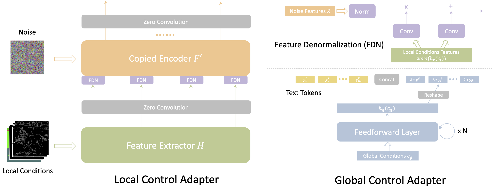

# Uni-ControlNet: All-in-One Control to Text-to-Image Diffusion Models

### [Project Page](https://shihaozhaozsh.github.io/unicontrolnet/)

<!-- ## Description -->

Text-to-Image diffusion models have made tremendous progress over the past two years, enabling the generation of highly realistic images based on open-domain text descriptions. However, despite their success, text descriptions often struggle to adequately convey detailed controls, even when composed of long and complex texts. Moreover, recent studies have also shown that these models face challenges in understanding such complex texts and generating the corresponding images. Therefore, there is a growing need to enable more control modes beyond text description. In this paper, we introduce Uni-ControlNet, a novel approach that allows for the simultaneous utilization of different local controls (e.g., edge maps, depth map, segmentation masks) and global controls (e.g., CLIP image embeddings) in a flexible and composable manner within one model. Unlike existing methods, Uni-ControlNet only requires the fine-tuning of two additional adapters upon frozen pre-trained text-to-image diffusion models, eliminating the huge cost of training from scratch. Moreover, thanks to some dedicated adapter designs, Uni-ControlNet only necessitates a constant number (i.e., 2) of adapters, regardless of the number of local or global controls used. This not only reduces the fine-tuning costs and model size, making it more suitable for real-world deployment, but also facilitate composability of different conditions. Through both quantitative and qualitative comparisons, Uni-ControlNet demonstrates its superiority over existing methods in terms of controllability, generation quality and composability.

## Schedule
- [ ] Release code and models (before May 30, 2023)

## Overview

### Pipeline

### Details

## Results 

