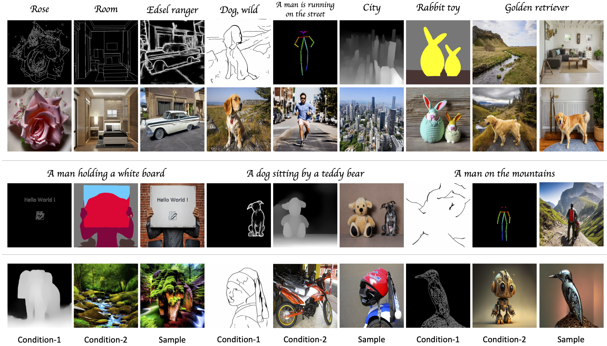
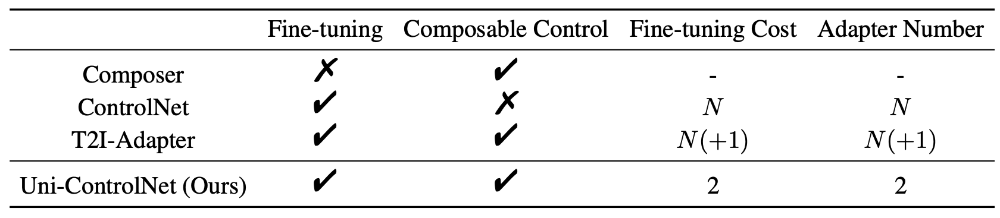
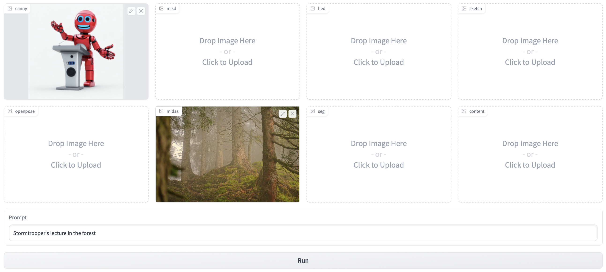
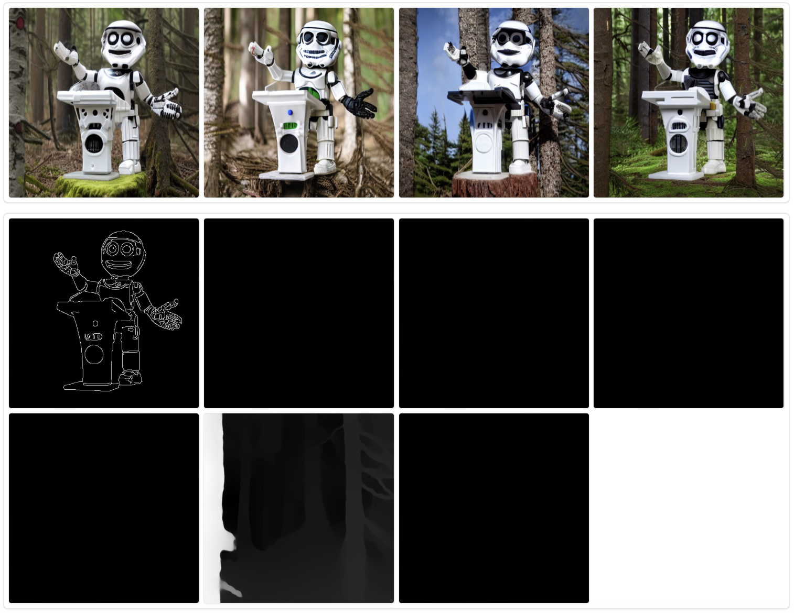
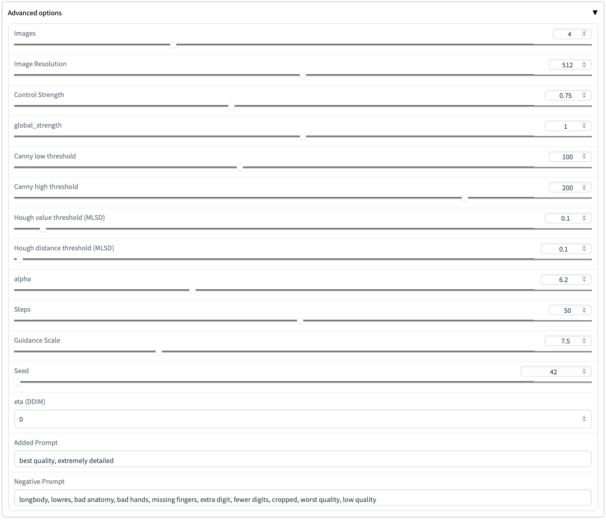
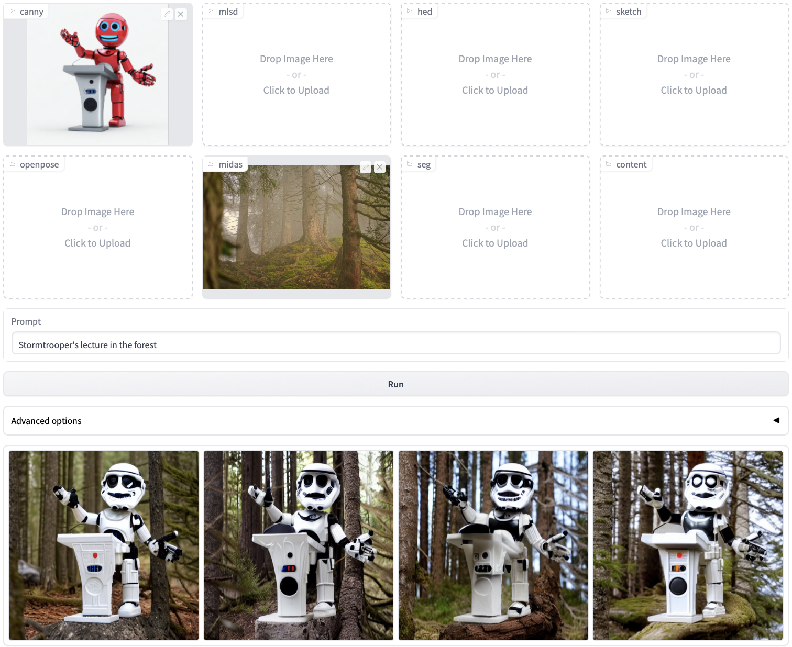
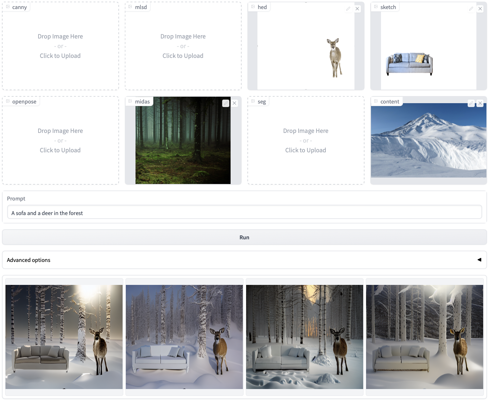

# [NeurIPS 2023] Uni-ControlNet: All-in-One Control to Text-to-Image Diffusion Models

Official implementation of Uni-ControlNet: All-in-One Control to Text-to-Image Diffusion Models, which is accepted by NeurIPS 2023.

### [Project Page](https://shihaozhaozsh.github.io/unicontrolnet/) | [Paper (ArXiv)](https://arxiv.org/abs/2305.16322) 



## ⏳ : To Do
- [x] Release training code
- [x] Release test code
- [x] Release pre-trained models

## 💡 : Method
<div align="center">

</div>

Uni-ControlNet is a novel controllable diffusion model that allows for the simultaneous utilization of different local controls and global controls in a flexible and composable manner within one model. This is achieved through the incorporation of two adapters - local control adapter and global control adapter, regardless of the number of local or global controls used. These two adapters can be trained separately without the need for joint training, while still supporting the composition of multiple control signals. 

<div align="center">

</div>

Here are the comparisons of different controllable diffusion models. N is the number of conditions. Uni-ControlNet not only reduces the fine-tuning costs and model size as the number of the control conditions grows, but also facilitates composability of different conditions.

## ⚙ : Setup
First create a new conda environment

    conda env create -f environment.yaml
    conda activate unicontrol

Then download the [pretrained model](https://drive.google.com/file/d/1lagkiWUYFYbgeMTuJLxutpTW0HFuBchd/view?usp=sharing) ([or here](https://huggingface.co/shihaozhao/uni-controlnet/blob/main/uni.ckpt)) and put it to `./ckpt/` folder. The model is built upon Stable Diffusion v1.5.

## 💻 : Test
You can launch the gradio demo by:

    python src/test/test.py
    
This command will load the downloaded pretrained weights and start the App. We include seven example local conditions: Canny edge, MLSD edge, HED boundary, sketch, Openpose, Midas depth, segmentation mask, and one example global condition: content. 

<div align="center">

</div>

You can first upload a source image and our code automatically detects its sketch. Then Uni-ControlNet generates samples following the sketch and the text prompt which in this example is "Robot spider, mars". The results are shown at the bottom of the demo page, with generated images in the upper part and detected conditions in the lower part:

<div align="center">

</div>

You can further detail your configuration in the panel：

<div align="center">

</div>

Uni-ControlNet also handles multi-conditions setting well. Here is an example of the combination of two local conditions: Canny edge of the Stormtrooper and the depth map of a forest. The prompt is set to "Stormtrooper's lecture in the forest" and here are the results:

<div align="center">

</div>

With Uni-ControlNet, you can go even further and incorporate more conditions. For instance, you can provide the local conditions of a deer, a sofa, a forest, and the global condition of snow to create a scene that is unlikely to occur naturally. The prompt is set to "A sofa and a deer in the forest" and here are the results.

<div align="center">

</div>

## ☕️ : Training

You should first download the pretrained weights of [Stable Diffusion](https://huggingface.co/runwayml/stable-diffusion-v1-5/blob/main/v1-5-pruned.ckpt) and put it to `./ckpt/` folder. Then, you can get the initial weights for training by:

    python utils/prepare_weights.py init_local ckpt/v1-5-pruned.ckpt configs/local_v15.yaml ckpt/init_local.ckpt
    
    python utils/prepare_weights.py init_global ckpt/v1-5-pruned.ckpt configs/global_v15.yaml ckpt/init_global.ckpt

The 4 arguments are mode, pretrained SD weights, model configs and output path for the initial weights.

To prepare the training data, please ensure that they are placed in the `./data/` folder and organized in the following manner:

```
data/
├── anno.txt
├── images/
├── conditions/
    ├── condition-1/
    ├── condition-2/
    ...
...
```

Specifically, you can utilize the condition detectors in `./annotator/` to extract the conditions. Then, you have to put the original images into `./data/images/` folder and the extracted conditions into `./data/conditions/condition-N/` folder. And `./data/anno.txt` is the annotation file, where each line represents a training sample and is divided into two parts: 1) file ID and 2) annotation. Please ensure the consistency between the file IDs in `./data/anno.txt`， `./data/images/` and `./data/conditions/condition-N/` directories.

Now, you can train with you own data simply by:

    python src/train/train.py

Kindly note that the local adapter and global adapter must be trained separately. Additionally, you can customize the training configurations in `./src/train/train.py` and `./configs/`. 

Once you have completed separate training, you will need to integrate the two adapters by:

    python utils/prepare_weights.py integrate path1 path2 configs/uni_v15.yaml path3

Path1 and path2 refer to the trained weights of SD with local and global adapters, respectively, while path3 denotes the output path for Uni-ControlNet.

## 🎉 : Acknowledgments:

This repo is built upon [ControlNet](https://github.com/lllyasviel/ControlNet/tree/main) and really thank to their great work!

## 📖 : Citation

```bibtex
@article{zhao2023uni,
  title={Uni-ControlNet: All-in-One Control to Text-to-Image Diffusion Models},
  author={Zhao, Shihao and Chen, Dongdong and Chen, Yen-Chun and Bao, Jianmin and Hao, Shaozhe and Yuan, Lu and Wong, Kwan-Yee~K.},
  journal={Advances in Neural Information Processing Systems},
  year={2023}
}
```
